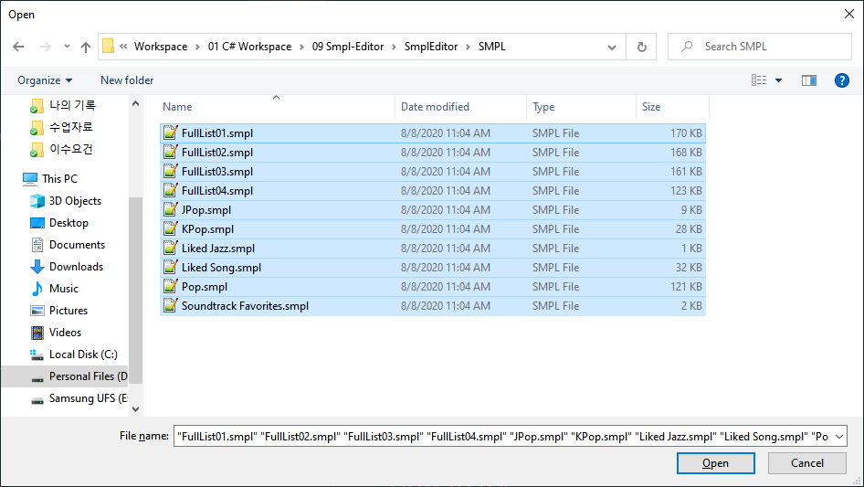
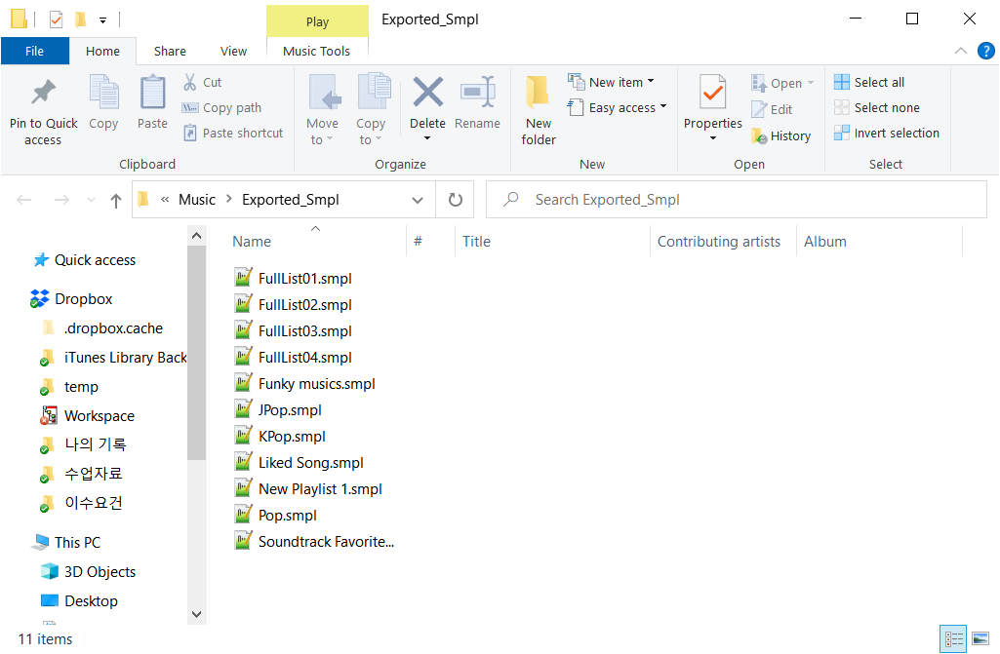

# Smpl-Editor
A tool to make smpl editing for Samsung Music Player easier

# Features
- Load playlists from .smpl files
- View playlist contents(songs)
- Add or remove songs from playlists or from all songs
- Create new playlists or delete existing playlists
- Export the playlists into .smpl format
- Sort songs according to various tags

# .smpl files json structure
.smpl  
|- members\:List of jsons  
|\_\_L- song(Arbitrary name that I gave to the data structure)  
|\_\_\_\_| - artist\:string  
|\_\_\_\_| - info\:stirng  
|\_\_\_\_| - order\:int  
|\_\_\_\_| - title\:string  
|\_\_\_\_L- type\:int  
| - recentlyPlayedDate\:int  
| - name\:string  
| - sortBy\:int  
L- version\:int  

# How to use
  1. Export playlists as .smpl files on your phone  
      
  or,  
      
  2. Move the files to your Windows PC  
  
  3. Open the program and load the Smpls. You will see the whole list of musics included in the playlists.
    
  4. You can go to each playlists and view them.
  
  5. Select multiple songs(Utilize ctrl and shift keys) and delete or add them to other playlists.
  - deleting **vvv**  
      
  - adding **vvv**  
      
    **^**
    The playlist we want to add the songs to.
    **^**  
      
    **^**
    Select songs from a playlist.
    **^**  
      
    **^**
    Choose a target playlist.
    **^**  
      
    **^**
    Add songs to the playlist.
    **^**  
      
    **^**
    Now they are added to the target list.
    **^**  
    ***If you remove songs from the All Songs list, then it will be deleted from every playlists.***
  6. You can also create a new playlist or remove existing ones with the buttons on the bottom left.
  - removing **vvv**  
        
  - creating new list **vvv**  
      
    **^**
    Select the songs to start with the new playlist. It's okay to choose none.
    **^**  
      
  7. Sort songs  
  8. Export lists  
  This will export all the lists to a selected folder under an automatically created subfolder named Exported_Smpl. **vvv**  
    

---
# Program code detail
`class Smpl`:
- Has 5 fields as specified in the json structure: `name`, `memebers`, `recentlyPlayedDate`, `sortBy`, `version`
  - `members` field is implemented as `List<Song>`. I chose to use `List` structure over `array` because the songs will be added and removed constantly from it.
- Methods:
  - constructer: For all the cases a new instance of `Smpl` is instantiated(in this app), it is called with a `name` and the `List` of `Songs`. The rest of the fields are filled with reasonable arbitrary values.
  - `AddSong`: It takes a `Song` object as an input adds a *deep copy* of the object to this instance. This is because of a couple of resons but most importantly, a `Song` contains the information of its `order` in a playlist. Since this value differs among playlists, it is necessary to store a deep copy of the object. The deep copying is done in a method of `Song` class.It also manages the `order` of the new song.
  - `AddSongs`: This method takes a `List<Song>` or an array of `Song` and adds them sequentially to the list. This method calls `AddSong` method in a loop.
  - `RemoveSong`: This method takes a `Song` object and removes it from the playlist. The exception of the song not being in the playlist is handled by prinitng out debug message(basically ignoring for end user). This method not only deletes the song but also manages the `order` shifting.
  - `RemoveSongs`: This method takes a `List<Song>` or an array of `Song` and removes it from the playlist.
  - `ToString`: Directly printing this class or anywhere it is represented as a string, it uses its `name` property for that.
  - various `SortBy...`s: This sorts the `members` accordingly.
  - Deep copying of a full `Smpl` is also supported.  
  
`class Song`:
- Has 5 properties: `artist`, `info`, `order`, `title`, `type`
- Methods:
  - `upperDirectory`: returns directory without the file name. ex)/external/Music/trending/DontStopMeNow.mp3 -> /external/Music/trending
  - `DeepCopy`: returns a new separate instance of the same song.
  - `ToString`: Directly printing this class or anywhere it is represented as a string, it uses "`artist` - `title`" format for that.
  - `DeepCompareSongs`: This method returns a boolean depending on the comparison or its `artist` and `title` value.(full path is also possible with the `strict` option)
